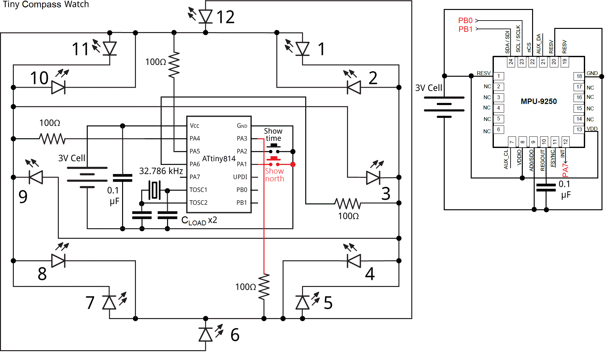
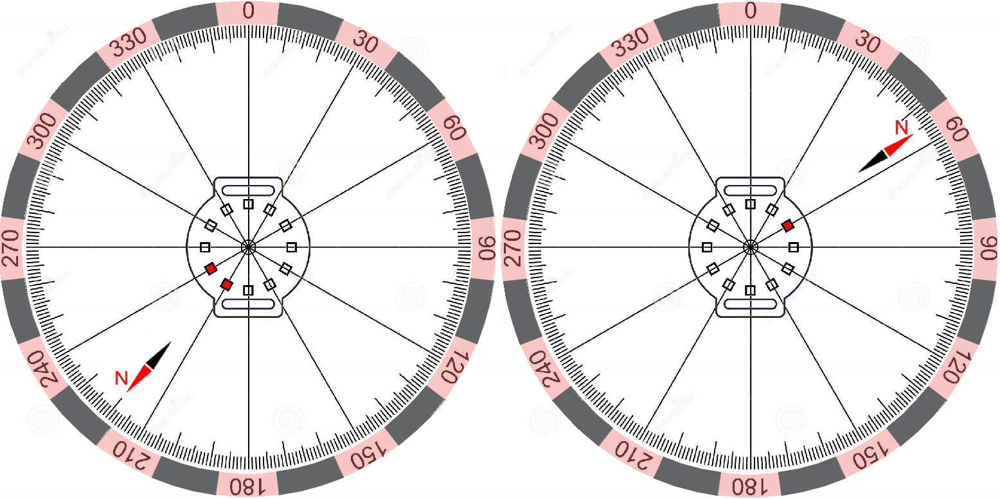

# Tiny-Compass-Watch
*An electronic watch that makes hard to get lost*

The Tiny Compass Watch is an extended version of the [Mega Tiny Time Watch](https://github.com/technoblogy/mega-tiny-time-watch/) project created by [David Johnson-Davies](https://github.com/technoblogy). In order to obtain a compass functionality, just three additional components have been used: MPU-9250 (TDK InvenSense), 0.1µF capacitor and a push button. A minimal modifications of the original circuit have been made: push button connected to the PA1 line, MPU-9250 chip connected to the ATtiny814 via Two Wire Interface (INT output of the MPU-9250 connected to PA7 pin just for a possible future improvements).


<p align="center">Figure 1. Circuit diagram of the Tiny Compass Watch

  The [MPU-9250](https://invensense.tdk.com/products/motion-tracking/9-axis/mpu-9250/) is a System in Package (SiP) that combines two chips: the MPU-6500 (which contains a 3-axis gyroscope and a 3-axis accelerometer), and the AK8963 (3-axis digital compass). A 3-axis accelerometer have been used for tilt compensation (some theory can be found [here](https://ieeexplore.ieee.org/abstract/document/838300)). The AK8963 has resolution of 16-bits (0.15 µT per LSB) which is quite enough to detect Earth's magnetic field (50-60 µT). Gyroscope remain always not active. The total power consumption in sleep mode is ~9µA, an estimated battery life from a single CR2016 battery is more than a year (from experience: more than 6 months of intensive usage from a single CR2032 battery).
  
  **Code Details**
  
  A single line of code should be changed according to your location (visit [noaa.gov](https://www.ngdc.noaa.gov/geomag/calculators/magcalc.shtml#declination) website to calculate the declination angle):
  ```C++
                       #define Declination     8       // For Kyiv, Ukraine ~ +8 deg (2022 year)
```
  The [TinyMegaI2C Library](https://github.com/technoblogy/tiny-mega-i2c) by David Johnson-Davies has been chosen for communication with MPU-9250. However, *TinyMegaI2C.read()* function replaced, as was discussed [here](https://github.com/technoblogy/tiny-mega-i2c/issues/3). The corresponding function proposed by [buckket](https://gist.github.com/buckket/09619e6cdc5dee056d41bfb57065db81) has been used. Also, I2C clock frequency decreased down to 20kHz for a proper work with an internal pull-up resistors.
  
  Two buttons on a board means more flexible device control. Press and hold the *Show North* button, then press the *Show Time* button to launch the compass calibration procedure (each LED blink one-by-one clockwise starting from 12 - the *DisplayCircle()* function indicate start/done of the calibration procedure). During the calibration process, slowly rotate watch so that each side (front, back, left, right, top and bottom) points down towards the earth for a few seconds in turn. A concise algorithm proposed by [kriswiner](https://github.com/kriswiner/MPU6050/wiki/Simple-and-Effective-Magnetometer-Calibration) has been used in order to determine magnetometer calibration parameters:
  ```C++
                       void MagCalibration(uint16_t points) {
                       ...
                       // Hard-iron offsets
                       OFFX = (MAXX + MINX) >> 1;                           
                       OFFY = (MAXY + MINY) >> 1;
                       OFFZ = (MAXZ + MINZ) >> 1;
                       // Soft-iron scale factors
                       SCAX = 0.33 * (1 + (MAXY + MAXZ - MINY - MINZ) / (MAXX - MINX));
                       SCAY = 0.33 * (1 + (MAXX + MAXZ - MINX - MINZ) / (MAXY - MINY));
                       SCAZ = 0.33 * (1 + (MAXX + MAXY - MINX - MINY) / (MAXZ - MINZ));
                       ...
                    }
```
  
  This approach is not the best, but perhaps is the simplest one. It was found that accelerometer calibration is not mandatory (checked for five MPU-9250 chips), but the same algorithm could be used if needed. It should be note. that the electromagnetic field of a CR battery is an inertial and in general depends of it's space orientation, thus whenever you need precise direction or you are not shure - just launch the calibration procedure

  **Displaying North Direction**
  
  You can either press or press and hold *Show North* button whenever you want to find out north direction. 24 directions using 12 LEDs. Short flashes single LED or LEDs pair.
  

<p align="center">Figure 2. Example One or Two LEDs Short Flashes
  
  **Uploading Program**
