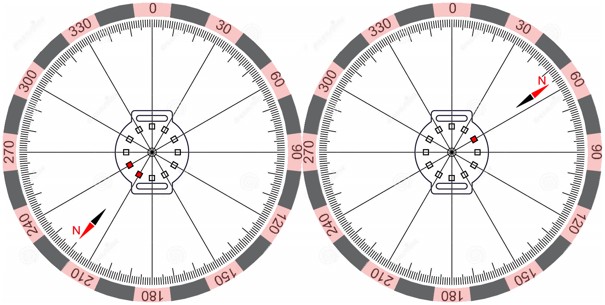

# Tiny-Compass-Watch
*Electronic watch that makes hard to get lost*


The Tiny Compass Watch is an extended version of the [Mega Tiny Time Watch](https://github.com/technoblogy/mega-tiny-time-watch/) project created by [David Johnson-Davies](https://github.com/technoblogy). In order to obtain a compass functionality, just three additional components have been used: MPU-9250 (TDK InvenSense), 0.1µF capacitor and a push button. A minimal modifications of the original circuit have been made: push button connected to the PA1 line, MPU-9250 chip connected to the ATtiny814 via Two Wire Interface (INT output of the MPU-9250 connected to PA7 pin just for a possible future improvements).


<p align="center">Circuit diagram of the Tiny Compass Watch

  The [MPU-9250](https://invensense.tdk.com/products/motion-tracking/9-axis/mpu-9250/) is a System in Package (SiP) that combines two chips: the MPU-6500 (which contains a 3-axis gyroscope and a 3-axis accelerometer), and the AK8963 (3-axis digital compass). A 3-axis accelerometer have been used for tilt compensation (some theory can be found [here](https://ieeexplore.ieee.org/abstract/document/838300)). The AK8963 has resolution of 16-bits (0.15 µT per LSB) which is quite enough to detect Earth's magnetic field (50-60 µT). Gyroscope remain always not active. The total power consumption in sleep mode is ~9µA, an estimated battery life from a single CR2016 battery is more than a year (from experience: more than 6 months of intensive usage from a single CR2032 battery).
  
  **Code Details**
  
  A single line of code should be changed according to your location (visit [noaa.gov](https://www.ngdc.noaa.gov/geomag/calculators/magcalc.shtml#declination) website to calculate the declination angle):
  ```C++
  #define Declination     8                       // For Kyiv, Ukraine ~ +8 deg (2022 year)
```
  The [TinyMegaI2C Library](https://github.com/technoblogy/tiny-mega-i2c) by David Johnson-Davies has been chosen for communication with MPU-9250. However, *TinyMegaI2C.read()* function replaced, as was discussed [here](https://github.com/technoblogy/tiny-mega-i2c/issues/3). The corresponding function proposed by [buckket](https://gist.github.com/buckket/09619e6cdc5dee056d41bfb57065db81) has been used. Also, I2C clock frequency decreased down to 20kHz for a proper work with an internal pull-up resistors.
  
  The program interact with minimally sufficient set of the MPU-9250 registers. In order to separately operate the AK8963 and MPU-6500 devices bypass mode should be selected. Magnetometer factory calibrations of the axial sensitivity (ASAX,ASAY,ASAZ) have been read and applied for both the measurements
and calibration.
  ```C++
  void SetMPU9250() {
    ...
    I2CSetRegister(ACEL_GIRO, INT_PIN_CFG, 0x02); // Set bypass enable bit
    ...
    I2CSetRegister(MAG, AK8963_CNTL1, 0x0F);      // Fuse ROM access mode
    TinyMegaI2C.start(MAG, 0);
    TinyMegaI2C.write(AK8963_ASAX);
    TinyMegaI2C.restart(MAG, -1);
    uint8_t asax = TinyMegaI2C.read(0x01);        // Read x sensitivity adjustment value, send ACK
    uint8_t asay = TinyMegaI2C.read(0x01);        // Read y sensitivity adjustment value, send ACK
    uint8_t asaz = TinyMegaI2C.read(0x00);        // Read z sensitivity adjustment value, send NACK
    TinyMegaI2C.stop();
    ASAX = (float) (asax / 256.) + .5;
    ASAY = (float) (asay / 256.) + .5;
    ASAZ = (float) (asaz / 256.) + .5;
    ...
  }
```
  When not in power-down mode, the AK8963 operates in Continuous measurement mode 2 - kind of compromise between performance and power consumption:
   ```C++
  void WakeAK8963() {
    I2CSetRegister(MAG, AK8963_CNTL1, 0x16);      // 16-bit output, Continuous measurement mode 2
  }
```
  
  Two buttons on a board means more flexible device control. Press and hold the *Show North* button, then press the *Show Time* button to launch the compass calibration procedure (each LED blink one-by-one clockwise starting from 12 - the *DisplayCircle()* function indicate start/done of the compass calibration procedure). During the calibration process, slowly rotate watch so that each side (front, back, left, right, top and bottom) points down towards the earth for a few seconds in turn. A concise algorithm proposed by [kriswiner](https://github.com/kriswiner/MPU6050/wiki/Simple-and-Effective-Magnetometer-Calibration) has been used in order to determine magnetometer calibration parameters:
  ```C++
  void MagCalibration(uint16_t points) {
    ...
    /* Hard-iron offsets */
    OFFX = (MAXX + MINX) >> 1;                           
    OFFY = (MAXY + MINY) >> 1;
    OFFZ = (MAXZ + MINZ) >> 1;
    /* Soft-iron scale factors */
    SCAX = (float) (1 + (MAXY + MAXZ - MINY - MINZ) / (MAXX - MINX)) * .33;
    SCAY = (float) (1 + (MAXX + MAXZ - MINX - MINZ) / (MAXY - MINY)) * .33;
    SCAZ = (float) (1 + (MAXX + MAXY - MINX - MINY) / (MAXZ - MINZ)) * .33;
    ...
  }
```
  May not be the best approach, but probably the simplest one. It was found that an accelerometer calibration is not mandatory (checked for five MPU-9250 chips), but the same algorithm could be used if needed. It should be noted that the electromagnetic field of a CR20XX battery (which is placed very close to the MPU-9250) depends on it's charge (time-dependent value), temperature and even spatial orientation, so whenever you need a precise direction or the device has not been used for a long time - just launch the calibration procedure.
  
  Press the *Show Time* button, then press the *Show North* button to launch the time correction procedure (LEDs from 6 to 12 blink one-by-one anti-clockwise - the *DisplaySemicircle()* function indicate start/done of the time correction procedure) - simply subtract 30 seconds from current time.
  
  The earth's horizontal magnetic field components have been calculated without explicit sine or cosine functions:
  ```C
  uint16_t MyHeading (int8_t angular_adjustment) {
  WakeAccel(); AccelRead(); SleepAccel();               // Update global variables AX, AY, AZ
  WakeAK8963(); MagRead(); SleepAK8963();               // Update global variables HX, HY, HZ
  double AVEC = sqrt(double((AX * AX) + (AY * AY) + (AZ * AZ)));
  // Horizontal magnetic field components
  double HXh = AVEC * HX * sqrt(double((AX * AX) + (AZ * AZ))) - HY * AX * AY + HZ * AY * sqrt(double((AY * AY) + (AZ * AZ)));
  double HYh = AVEC * (HY * sqrt(double((AY * AY) + (AZ * AZ))) + HZ * AX);
  int16_t Heading = int(atan2(HYh, HXh) * RAD_TO_DEG);  // Magnetic North
  Heading += angular_adjustment;                        // Geographic North
  if (Heading < 0) Heading += 360;                      // Allow for under/overflow
  if (Heading >= 360) Heading -= 360;
  return(Heading);
}
```

  **Displaying North Direction**
  
  You can either press and release (brief flash) or press and hold (continuous short flashes) the *Show North* button whenever you want to find out North direction (demo video is available on [YouTube](https://www.youtube.com/watch?v=BqxkJCPgP0E)). Original 12 LEDs display has been conditionally divided into 24 segments. Two possible cases are presented in the figure below: North direction lies in a *pink* segment (single LED flashes) or in a *grey* segment (two neighboring LEDs flashes).
  

<p align="center">Examples of how the Tiny Compass Watch displays North direction
  
  **Uploading Program**
  
  All instructions can be found on [Mega Tiny Time Watch](http://www.technoblogy.com/show?2OKF) page. However, there are a few differences. The first one is the code size: ATtiny814 and ATtiny1614 are suitable for the [Tiny Compass Watch](https://github.com/akapulko20/Tiny-Compass-Watch/blob/main/CompassWatch.ino) program. The second one - supply voltage range of 2.4 – 3.6V. **Do not power a fully assembled board via 5V supply!** Instead, insert a battery, connect UPDI and GND wires (for example, with a hook test clips) to the 10 and 14 legs, upload the program. [Gerber files](https://github.com/akapulko20/Tiny-Compass-Watch/raw/main/Gerber_Tiny_Compass_Watch%20.zip) for PCB fabrication attached.
